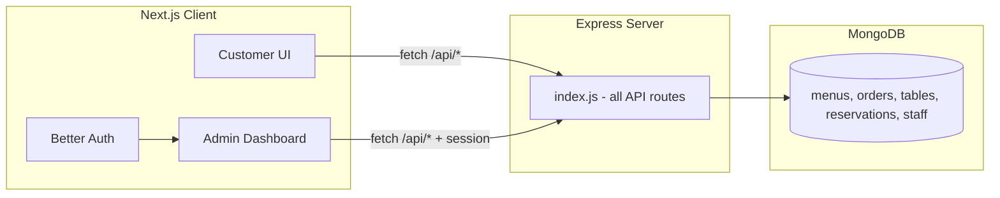
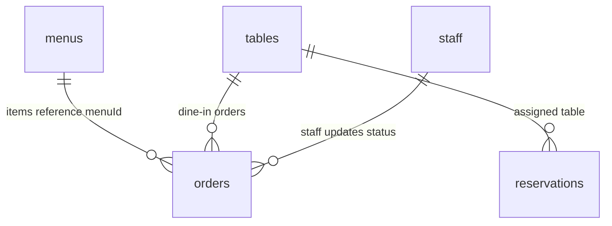
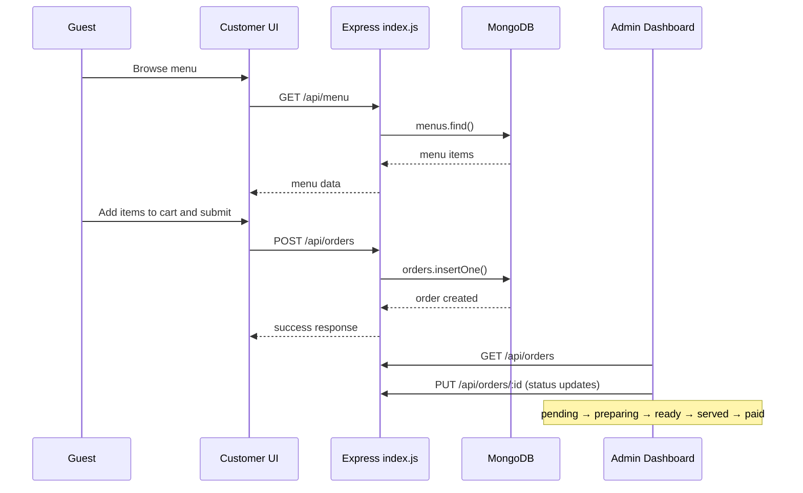
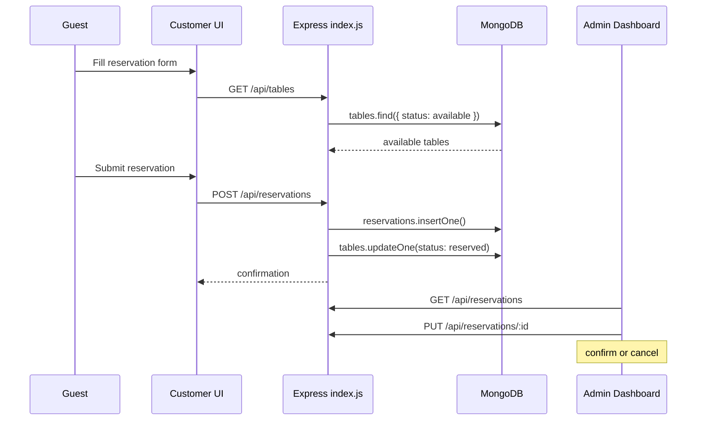

# Restaurant Management System — Architecture

## 1. System Overview

The Restaurant Management System is a full-stack web application for running day-to-day restaurant operations. It serves two audiences from a single Next.js client:

- **Customer-facing UI** — public pages where guests browse the menu, place orders, and book table reservations (no login required).
- **Admin dashboard** — a protected staff area for managing menu items, tables, orders, reservations, and staff accounts.

The system follows a **simple monolith** design: one Express server file (`server/index.js`) handles all API logic, and one Next.js app handles all UI. No MVC layers, no microservices, no TypeScript.

---

## 2. Tech Stack

| Layer | Technology |
|-------|------------|
| Server runtime | Node.js |
| Server framework | Express |
| Database | MongoDB (native `mongodb` driver) |
| Client framework | Next.js (App Router) |
| Language | JavaScript only (no TypeScript) |
| Authentication | Better Auth |
| Styling | Tailwind CSS + DaisyUI |

**Intentionally excluded:** Mongoose, TypeScript, MVC architecture, ORMs, microservices, message queues, caching layers.

---

## 3. High-Level Architecture



**Request flow:**
1. Customer or staff interacts with the Next.js UI.
2. The client calls REST endpoints on the Express server (`/api/*`).
3. Express reads/writes MongoDB collections using the native driver.
4. Staff-only pages require a valid Better Auth session with the correct role.

---

## 4. Project Structure

```
restaurant-management/
├── server/
│   ├── index.js              # Single file: DB connection + all routes
│   ├── package.json
│   └── .env
└── client/
    ├── app/
    │   ├── (public)/         # Customer-facing pages
    │   │   ├── page.js       # Landing + featured menu
    │   │   ├── menu/         # Full menu browse
    │   │   ├── order/        # Place order
    │   │   └── reserve/      # Book a table
    │   ├── (dashboard)/      # Admin / staff pages (auth-protected)
    │   │   ├── dashboard/    # Overview stats
    │   │   ├── menu/         # Menu CRUD
    │   │   ├── orders/       # Order management
    │   │   ├── tables/       # Table management
    │   │   ├── reservations/ # Reservation management
    │   │   ├── staff/        # Staff management
    │   │   └── settings/     # Admin settings
    │   └── login/            # Staff login
    ├── components/           # Shared UI (Navbar, MenuCard, StatCard, etc.)
    ├── lib/                    # api.js, auth.js
    ├── public/
    ├── package.json
    ├── tailwind.config.js
    ├── postcss.config.js
    └── jsconfig.json
```

### Backend file organization (`server/index.js`)

All backend code lives in one file, grouped by comment sections:

```js
// ─── Dependencies ───
// ─── Config ───
// ─── MongoDB Connection ───
// ─── Collections ───
// ─── Middleware ───
// ─── Routes ───
// ─── Start Server ───
```

---

## 5. User Roles and Access

| Role | Customer UI | Admin Dashboard |
|------|-------------|-----------------|
| Guest (no login) | Browse menu, place order, book reservation | No access |
| Staff | Same as guest | View and update orders, tables, reservations |
| Manager | Same as guest | Full CRUD on menu, tables, reservations |
| Admin | Same as guest | Full access + staff management + settings |

Authentication is handled by **Better Auth** on the client. Dashboard routes check the session and role before rendering. Destructive actions (delete menu item, cancel order) are restricted to `admin` and `manager` roles.

---

## 6. Data Model

Five MongoDB collections using plain JavaScript documents (no Mongoose schemas).

### Collections

#### `menus`
| Field | Type | Description |
|-------|------|-------------|
| `_id` | ObjectId | Auto-generated |
| `name` | string | Item name |
| `description` | string | Short description |
| `price` | number | Price in local currency |
| `category` | string | e.g. appetizers, mains, drinks |
| `imageUrl` | string | Optional image URL |
| `available` | boolean | Whether item is orderable |

#### `tables`
| Field | Type | Description |
|-------|------|-------------|
| `_id` | ObjectId | Auto-generated |
| `number` | number | Table number |
| `capacity` | number | Max guests |
| `status` | string | `available` / `occupied` / `reserved` |

#### `orders`
| Field | Type | Description |
|-------|------|-------------|
| `_id` | ObjectId | Auto-generated |
| `items` | array | `[{ menuId, name, price, quantity }]` |
| `tableId` | ObjectId | Linked table (dine-in only) |
| `orderType` | string | `dine-in` / `takeaway` |
| `status` | string | `pending` → `preparing` → `ready` → `served` → `paid` |
| `total` | number | Order total |
| `customerName` | string | Guest name |
| `createdAt` | date | Timestamp |

#### `reservations`
| Field | Type | Description |
|-------|------|-------------|
| `_id` | ObjectId | Auto-generated |
| `guestName` | string | Guest name |
| `phone` | string | Contact number |
| `date` | string | Reservation date |
| `time` | string | Reservation time |
| `partySize` | number | Number of guests |
| `tableId` | ObjectId | Assigned table |
| `status` | string | `pending` / `confirmed` / `cancelled` |

#### `staff`
Managed via Better Auth. Stored fields include `name`, `email`, and `role` (`admin`, `manager`, `staff`).

### Entity Relationships



---

## 7. API Design

All routes live in `server/index.js` under the `/api` base path.

### Response format

```js
// Success
{ "success": true, "data": { ... } }

// Error
{ "success": false, "message": "Human-readable error" }
```

### Endpoints

| Domain | Method | Endpoint | Access |
|--------|--------|----------|--------|
| Menu | GET | `/api/menu` | Public |
| Menu | POST | `/api/menu` | Admin, Manager |
| Menu | PUT | `/api/menu/:id` | Admin, Manager |
| Menu | DELETE | `/api/menu/:id` | Admin, Manager |
| Tables | GET | `/api/tables` | Public |
| Tables | POST | `/api/tables` | Staff+ |
| Tables | PUT | `/api/tables/:id` | Staff+ |
| Tables | DELETE | `/api/tables/:id` | Admin, Manager |
| Orders | GET | `/api/orders` | Staff+ |
| Orders | POST | `/api/orders` | Public |
| Orders | PUT | `/api/orders/:id` | Staff+ |
| Reservations | GET | `/api/reservations` | Staff+ |
| Reservations | POST | `/api/reservations` | Public |
| Reservations | PUT | `/api/reservations/:id` | Staff+ |
| Reservations | DELETE | `/api/reservations/:id` | Staff+ |
| Staff | GET | `/api/staff` | Admin |
| Staff | POST | `/api/staff` | Admin |
| Staff | PUT | `/api/staff/:id` | Admin |
| Staff | DELETE | `/api/staff/:id` | Admin |
| Stats | GET | `/api/stats` | Staff+ |

### Database access pattern

```js
const { MongoClient, ObjectId } = require('mongodb');

const menu = db.collection('menus');
const items = await menu.find({}).toArray();
await menu.insertOne({ name, price, category, available: true });
await menu.updateOne({ _id: new ObjectId(id) }, { $set: { name, price } });
await menu.deleteOne({ _id: new ObjectId(id) });
```

---

## 8. Key User Flows

### Customer Order Flow



### Reservation Flow



---

## 9. Frontend UI

### Customer-facing (public, no login)

| Page | Route | Purpose |
|------|-------|---------|
| Landing | `/` | Restaurant info, featured menu items, links to order and reserve |
| Menu | `/menu` | Full menu with categories and filters |
| Order | `/order` | Cart, table selection (dine-in) or takeaway, submit order |
| Reserve | `/reserve` | Date/time picker, party size, contact info, table booking |

Built with Tailwind CSS and DaisyUI components (`card`, `btn`, `navbar`, `badge`). Responsive and mobile-friendly.

### Admin dashboard (auth-protected)

| Page | Route | Purpose |
|------|-------|---------|
| Dashboard | `/dashboard` | Today's orders, revenue, table occupancy, upcoming reservations |
| Menu | `/dashboard/menu` | CRUD for menu items |
| Orders | `/dashboard/orders` | Order list with status board (update pending → paid) |
| Tables | `/dashboard/tables` | Table grid with status management |
| Reservations | `/dashboard/reservations` | View, confirm, or cancel bookings |
| Staff | `/dashboard/staff` | Manage staff accounts and roles (admin only) |
| Settings | `/dashboard/settings` | Profile and basic config (admin only) |
| Login | `/login` | Staff authentication via Better Auth |

Layout uses a DaisyUI sidebar or drawer navigation. All dashboard pages show loading states, empty states, and error alerts.

### Shared components (`client/components/`)

| Component | Used by |
|-----------|---------|
| `Navbar` | Public pages |
| `MenuCard` | Landing, menu browse, order cart |
| `OrderStatusBadge` | Orders dashboard |
| `TableGrid` | Tables dashboard, reservation form |
| `StatCard` | Dashboard overview |
| `Sidebar` | Admin dashboard layout |

### API helper (`client/lib/api.js`)

```js
const API = process.env.NEXT_PUBLIC_API_URL;

export async function getMenu() {
  const res = await fetch(`${API}/api/menu`);
  if (!res.ok) throw new Error('Failed to fetch menu');
  return res.json();
}
```

---

## 10. Environment Variables

### `server/.env`

```
PORT=5000
MONGODB_URI=mongodb://localhost:27017/restaurant-db
CLIENT_URL=http://localhost:3000
```

### `client/.env.local`

```
NEXT_PUBLIC_API_URL=http://localhost:5000
```

### Local development

| Service | Port |
|---------|------|
| Express API | 5000 |
| Next.js client | 3000 |
| MongoDB | 27017 (default) |

Run MongoDB locally, then start the server (`node index.js`) and client (`npm run dev`) in separate terminals.

---

## 11. Simplicity Rules

These constraints keep the system easy to build and maintain:

- **One backend file** — all API routes in `server/index.js`; no `routes/`, `controllers/`, or `models/` folders.
- **Native MongoDB driver** — use `mongodb` package directly; no Mongoose or ORM.
- **JavaScript only** — no TypeScript on server or client.
- **No heavy state libraries** — use React state and `fetch`; no Redux or Zustand unless explicitly needed.
- **Tailwind + DaisyUI only** — no extra CSS frameworks.
- **No microservices** — single Express process, single MongoDB instance, single Next.js app.

When adding a new feature: add collection queries and routes in `index.js`, then build the matching page and components on the client. Keep diffs focused and avoid introducing new architectural patterns.
