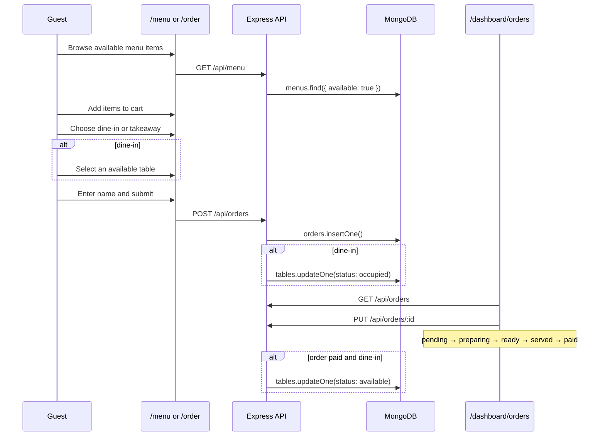
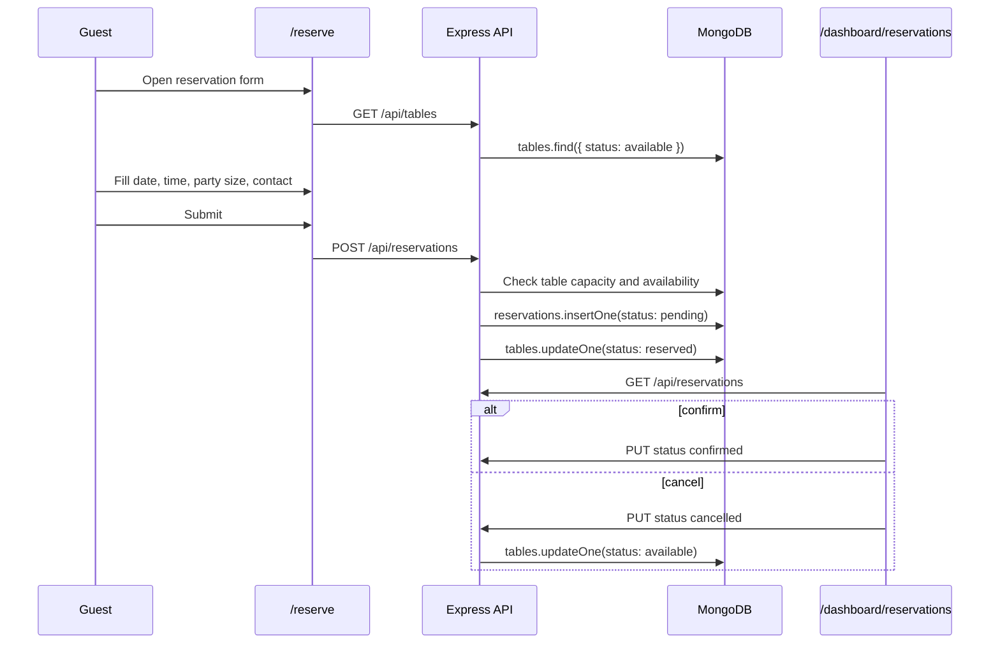

# Restaurant Management System — Feature List

This document defines **what the system does** — features, pages, roles, main flows, and MongoDB collection fields. It is a planning reference only. No schema files or implementation code yet.

See also: [Architecture.md](Architecture.md) for system design and [.cursorrules](.cursorrules) for coding rules.

---

## 1. Feature Overview

| # | Module | Description |
|---|--------|-------------|
| F1 | Menu | Browse and manage food/drink items by category |
| F2 | Tables | Track table number, capacity, and live status |
| F3 | Orders | Customers place orders; staff track and update status |
| F4 | Reservations | Customers book tables; staff confirm or cancel |
| F5 | Staff | Admin manages staff accounts and roles |
| F6 | Dashboard | Staff overview of today's operations and stats |
| F7 | Auth | Staff login via Better Auth; role-based dashboard access |

---

## 2. Pages

### 2.1 Customer-facing (public — no login)

| Page | Route | Features |
|------|-------|----------|
| Landing | `/` | Restaurant name, short intro, featured menu items, links to order and reserve |
| Menu Browse | `/menu` | Full menu list, filter by category, show price and availability |
| Place Order | `/order` | Add items to cart, choose dine-in or takeaway, select table (dine-in), enter name, submit order |
| Book Table | `/reserve` | Pick date and time, party size, contact info, view available tables, submit reservation |

### 2.2 Admin dashboard (auth-protected)

| Page | Route | Features | Min Role |
|------|-------|----------|----------|
| Login | `/login` | Email/password sign-in for staff | — |
| Dashboard Home | `/dashboard` | Today's order count, revenue, table occupancy, upcoming reservations | Staff |
| Menu Management | `/dashboard/menu` | List, add, edit, delete menu items; toggle availability | Manager |
| Order Board | `/dashboard/orders` | View all orders, filter by status, update status step by step | Staff |
| Table Management | `/dashboard/tables` | View table grid, add/edit tables, change status | Staff |
| Reservations | `/dashboard/reservations` | View bookings, confirm, cancel, assign table | Staff |
| Staff Management | `/dashboard/staff` | List staff, add account, change role, deactivate | Admin |
| Settings | `/dashboard/settings` | Admin profile, basic restaurant info | Admin |

### 2.3 Shared UI components (used across pages)

| Component | Used on |
|-----------|---------|
| `Navbar` | All public pages |
| `MenuCard` | Landing, menu, order cart |
| `OrderStatusBadge` | Order board |
| `TableGrid` | Tables page, reservation form |
| `StatCard` | Dashboard home |
| `Sidebar` / `Drawer` | All dashboard pages |
| `ConfirmModal` | Delete actions on dashboard |

---

## 3. User Roles

### 3.1 Role definitions

| Role | Who | Purpose |
|------|-----|---------|
| **Guest** | Any visitor | Use customer-facing pages only |
| **Staff** | Waiters, kitchen helpers | Handle day-to-day operations |
| **Manager** | Floor manager | Full control over menu, tables, orders, reservations |
| **Admin** | Restaurant owner / IT | Everything staff and manager can do, plus staff and settings |

### 3.2 Access matrix

| Action | Guest | Staff | Manager | Admin |
|--------|:-----:|:-----:|:-------:|:-----:|
| Browse menu (public) | Yes | Yes | Yes | Yes |
| Place order (public) | Yes | Yes | Yes | Yes |
| Book reservation (public) | Yes | Yes | Yes | Yes |
| Access dashboard | No | Yes | Yes | Yes |
| View dashboard stats | No | Yes | Yes | Yes |
| View / update orders | No | Yes | Yes | Yes |
| View / update tables | No | Yes | Yes | Yes |
| View / manage reservations | No | Yes | Yes | Yes |
| Add / edit / delete menu items | No | No | Yes | Yes |
| Add / delete tables | No | No | Yes | Yes |
| Manage staff accounts | No | No | No | Yes |
| Access settings | No | No | No | Yes |

### 3.3 Auth notes

- Only **staff, manager, and admin** need accounts (Better Auth).
- Guests never log in — they submit orders and reservations with a name and optional phone.
- Role is stored on the staff record and checked on dashboard routes before rendering.
- Destructive actions (delete menu item, delete table, remove staff) require **manager** or **admin**.

---

## 4. Main Flows

### 4.1 Customer order flow



**Steps:**
1. Guest opens `/menu` or `/order` and sees available items.
2. Guest builds a cart and picks dine-in or takeaway.
3. For dine-in, guest selects a table with `available` status.
4. Guest submits — order is created with status `pending`.
5. Staff sees the order on `/dashboard/orders`.
6. Staff moves status: `pending` → `preparing` → `ready` → `served` → `paid`.
7. When paid (dine-in), table returns to `available`.

---

### 4.2 Reservation flow



**Steps:**
1. Guest opens `/reserve` and picks date, time, and party size.
2. System shows tables that are `available` and fit the party size.
3. Guest submits — reservation created as `pending`, table marked `reserved`.
4. Staff reviews on `/dashboard/reservations`.
5. Staff confirms or cancels.
6. On cancel, table returns to `available`.

---

### 4.3 Menu management flow (manager / admin)

1. Manager opens `/dashboard/menu`.
2. Views all items grouped by category.
3. Adds a new item (name, description, price, category, image URL).
4. Toggles `available` off to hide an item from the public menu without deleting it.
5. Edits or deletes an item as needed.

---

### 4.4 Staff login flow

1. Staff opens `/login`.
2. Enters email and password (Better Auth).
3. On success, redirected to `/dashboard`.
4. Sidebar shows only pages allowed for their role.
5. Unauthenticated access to `/dashboard/*` redirects to `/login`.

---

### 4.5 Dashboard overview flow

1. Staff opens `/dashboard` after login.
2. Page calls `GET /api/stats`.
3. Shows:
   - Total orders today
   - Revenue today (sum of paid orders)
   - Tables: available / occupied / reserved counts
   - Upcoming reservations (next few hours)
4. Quick links to orders and reservations boards.

---

## 5. MongoDB Collections and Fields

Plain JavaScript documents stored via the native `mongodb` driver. No Mongoose schemas. Fields below are the agreed shape — implementation goes directly into `server/index.js`.

### 5.1 `menus`

| Field | Type | Required | Notes |
|-------|------|----------|-------|
| `_id` | ObjectId | auto | MongoDB default |
| `name` | string | yes | Item name, e.g. "Grilled Salmon" |
| `description` | string | no | Short description for the menu card |
| `price` | number | yes | Price in local currency |
| `category` | string | yes | e.g. `appetizers`, `mains`, `desserts`, `drinks` |
| `imageUrl` | string | no | URL or path to item image |
| `available` | boolean | yes | `false` hides item from public menu |
| `createdAt` | date | yes | When item was added |

**Discussion:**
- `category` is a plain string, not a separate collection — keeps things simple.
- Use `available` instead of deleting items that are temporarily out of stock.
- Public menu endpoint should only return items where `available: true`.

---

### 5.2 `tables`

| Field | Type | Required | Notes |
|-------|------|----------|-------|
| `_id` | ObjectId | auto | MongoDB default |
| `number` | number | yes | Display number, e.g. 1, 2, 3 — must be unique |
| `capacity` | number | yes | Max guests, e.g. 2, 4, 6 |
| `status` | string | yes | `available` / `occupied` / `reserved` |
| `createdAt` | date | yes | When table was added |

**Discussion:**
- `status` is updated automatically when orders or reservations are created/closed.
- Reservation form filters by `status: available` and `capacity >= partySize`.
- Table `number` should be unique — validate on create in `index.js`.

---

### 5.3 `orders`

| Field | Type | Required | Notes |
|-------|------|----------|-------|
| `_id` | ObjectId | auto | MongoDB default |
| `items` | array | yes | `[{ menuId, name, price, quantity }]` — snapshot at order time |
| `tableId` | ObjectId | no | Required for dine-in; null for takeaway |
| `tableNumber` | number | no | Denormalized for easy display on order board |
| `orderType` | string | yes | `dine-in` / `takeaway` |
| `status` | string | yes | `pending` / `preparing` / `ready` / `served` / `paid` / `cancelled` |
| `total` | number | yes | Sum of item price × quantity |
| `customerName` | string | yes | Guest name at checkout |
| `customerPhone` | string | no | Optional contact |
| `notes` | string | no | Special requests, e.g. "no onions" |
| `createdAt` | date | yes | Order placed at |
| `updatedAt` | date | yes | Last status change |

**Discussion:**
- `items` stores a **snapshot** of name and price so the order history stays correct even if menu prices change later.
- `tableNumber` is copied from the table doc at order time — avoids extra lookups on the order board.
- Status flow is linear: `pending` → `preparing` → `ready` → `served` → `paid`. Staff can set `cancelled` from `pending` only.
- `GET /api/orders` is staff-only; `POST /api/orders` is public.

---

### 5.4 `reservations`

| Field | Type | Required | Notes |
|-------|------|----------|-------|
| `_id` | ObjectId | auto | MongoDB default |
| `guestName` | string | yes | Name on the booking |
| `phone` | string | yes | Contact number |
| `email` | string | no | Optional confirmation email later |
| `date` | string | yes | e.g. `"2026-07-15"` (ISO date string) |
| `time` | string | yes | e.g. `"19:00"` (24h format) |
| `partySize` | number | yes | Number of guests |
| `tableId` | ObjectId | yes | Assigned table |
| `tableNumber` | number | yes | Denormalized for display |
| `status` | string | yes | `pending` / `confirmed` / `cancelled` / `completed` |
| `notes` | string | no | Special requests |
| `createdAt` | date | yes | Booking submitted at |

**Discussion:**
- `date` and `time` are stored as strings for simplicity — no timezone library needed for v1.
- On create, server checks the table is `available` and `capacity >= partySize`.
- `completed` is set by staff after the guest has been seated and the reservation is done.
- Cancelled reservations free the table back to `available`.

---

### 5.5 `staff`

| Field | Type | Required | Notes |
|-------|------|----------|-------|
| `_id` | ObjectId | auto | MongoDB default |
| `name` | string | yes | Display name |
| `email` | string | yes | Login email — unique |
| `role` | string | yes | `admin` / `manager` / `staff` |
| `active` | boolean | yes | `false` blocks login without deleting the record |
| `createdAt` | date | yes | Account created at |

**Discussion:**
- Password hashing and sessions are handled by **Better Auth**, not stored in this collection directly.
- The `staff` collection holds role and profile data the API uses for access checks.
- Only admin can create or deactivate staff accounts.
- A staff member cannot change their own role.

---

## 6. API Summary (by feature)

| Feature | Public endpoints | Protected endpoints |
|---------|-----------------|---------------------|
| Menu | `GET /api/menu` | `POST`, `PUT`, `DELETE /api/menu` (manager+) |
| Tables | `GET /api/tables` | `POST`, `PUT`, `DELETE /api/tables` (staff+) |
| Orders | `POST /api/orders` | `GET`, `PUT /api/orders` (staff+) |
| Reservations | `POST /api/reservations` | `GET`, `PUT`, `DELETE /api/reservations` (staff+) |
| Staff | — | `GET`, `POST`, `PUT`, `DELETE /api/staff` (admin) |
| Stats | — | `GET /api/stats` (staff+) |

**Standard response:**
```js
{ success: true, data: { ... } }
{ success: false, message: "Error description" }
```

---

## 7. Build Order (suggested implementation sequence)

Implement features in this order to keep each step testable:

| Phase | What to build |
|-------|---------------|
| 1 | Server setup — Express, MongoDB connection, CORS, `index.js` skeleton |
| 2 | Tables — seed a few tables, public GET, dashboard CRUD |
| 3 | Menu — public GET (available items), dashboard CRUD |
| 4 | Orders — public POST, dashboard GET + status PUT |
| 5 | Reservations — public POST, dashboard GET + confirm/cancel PUT |
| 6 | Stats — `GET /api/stats` for dashboard home |
| 7 | Auth — Better Auth login, protect dashboard routes, role checks |
| 8 | Staff — admin staff management page |
| 9 | Customer UI polish — landing, menu, order, reserve pages with DaisyUI |
| 10 | Dashboard polish — sidebar, stat cards, status board, loading/empty states |

---

## 8. Out of Scope (v1)

Keep v1 simple. Do not build these unless explicitly requested:

- Online payment integration
- Email/SMS notifications
- Kitchen display system (separate screen)
- Inventory / stock tracking
- Multi-branch / franchise support
- Customer accounts or order history for guests
- Real-time WebSocket updates (page refresh or manual reload is fine for v1)
- Separate schema files, Mongoose models, or TypeScript types

---

## 9. Environment (reminder)

```
# server/.env
PORT=5000
MONGODB_URI=mongodb://localhost:27017/restaurant-db
CLIENT_URL=http://localhost:3000

# client/.env.local
NEXT_PUBLIC_API_URL=http://localhost:5000
```

| Service | Port |
|---------|------|
| Express API | 5000 |
| Next.js client | 3000 |
| MongoDB | 27017 |
